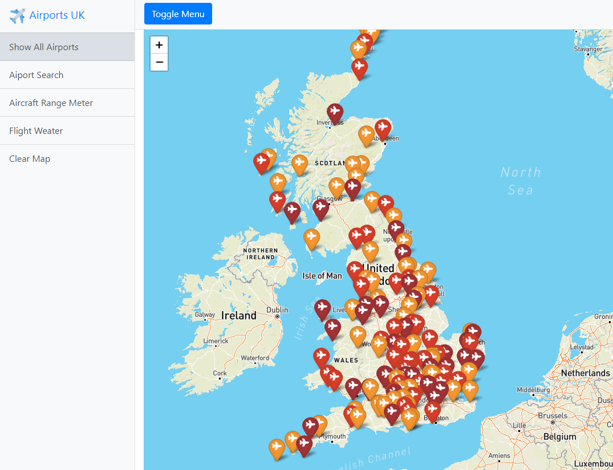
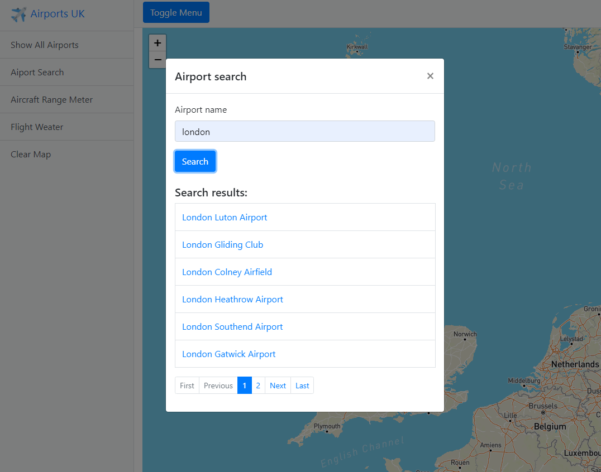
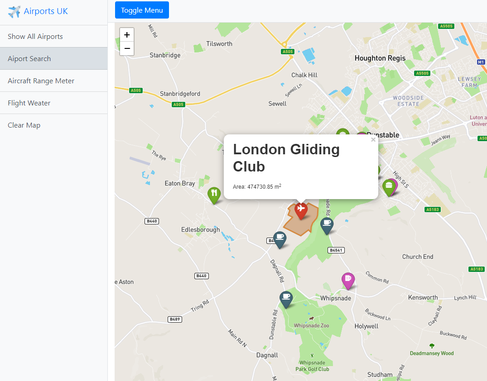
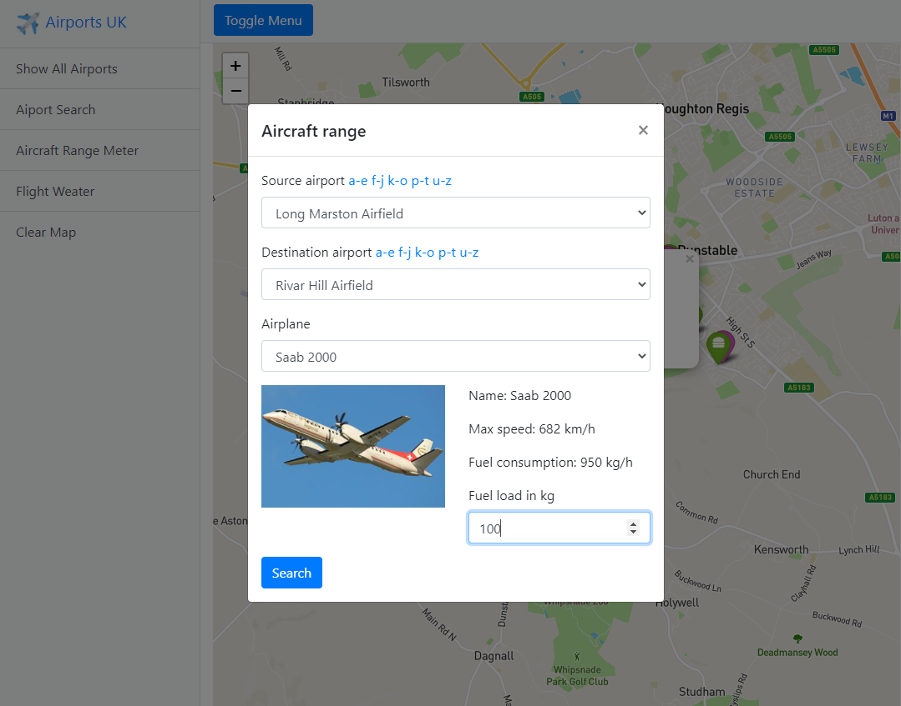
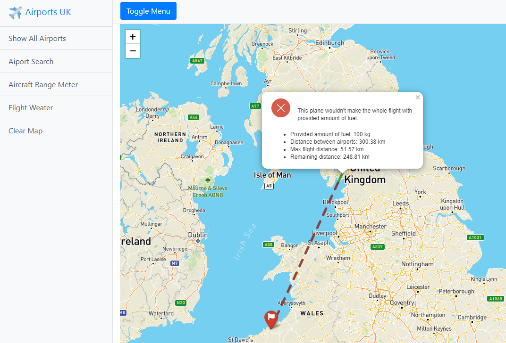
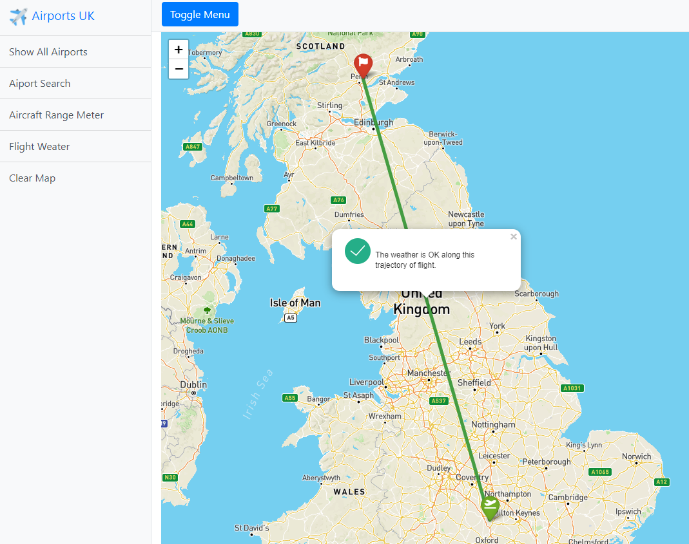

# Overview

This application is used to view airports of United Kingdom. The application supports the following use cases:

1. Show all available airports of United Kigdom
2. Search the airports and then view it
3. Show the nearest sustenance services of the airport
4. Calculate flight distance of aircraft between two airports
5. Show weather between two airports

## Show all airports
By clicking on "Show All Airports", all airports will be shown in the map. Then the user can click on any airport marker in the map and the app will zoom in the airport and show all the details, including  highlighted airport area and the nearest sustenance services within the radius of 5 kilometres. The color of the marker and airport area indicates size of airport, going from yellow to darkred in ascending order.

## Search the airport

User can search for a specific airport using "Airport Search" feature, whe he types the search value and the results will be shown. After clicking on one of the results, the map will zoom in the selected airport and display all the details, similarly like in the first scenario. 

## Flight distance
This feature can be activated by clicking on "Aircraft Range Meter" and it is used to calculated the flight range of a specific aircraft. Given the aircraft's fuel consumption and maximum speed, it calculates, whether the aircraft will make the whole flight between two airports or not.

## Flight weather
The use case is supposed to display the weather alongside the flight trajectoring between two airports. It can show the specific points on the map, where the weather is bad. 

# Frontend
The frontend is a static html page `index.html`, which is using a [Leaflet](https://leafletjs.com) javascript library to display the map and all the map features. The addition plugin [Leaflet.awesome-markers](https://github.com/lvoogdt/Leaflet.awesome-markers) was used to extend the styles of the markers to have different colors and icons. App also uses [JQuery](https://jquery.com) and [Bootstrap](https://getbootstrap.com/docs/4.3/getting-started/introduction/). 

The javascript code responsible for all the use cases can be located in the `Sever/public/js/scripts.js` file. 

# Backend
The backend is created in [NodeJS](https://nodejs.org/en/) environment using [Express](https://expressjs.com/) framework and it is used to serve static web pages and REST API. The geo data is acquired from Postgis DB with connection pools using [pg](https://www.npmjs.com/package/pg) package. The db queries are stored in service files inside `Server/services`. The geo queries are outputing data in GeoJSON format directly from db, there no further data processing is required.  

## Data
Geo data is from OpenStreetMaps. The United Kingdom extend was downloaded from this [repo](https://download.geofabrik.de/europe/great-britain.html) in osm.pbf format (1.2GB) and it was imported into standard OSM schema using `osm2pgsql` tool with caching size of 12000. 

Data of aircraft fuel consumption was downloaded from this [source](https://www.airliners.net/forum/viewtopic.php?t=1355819). Then I manually collected remaining data about selected airplanes from the internet. Data were stored into csv format and parsed into SQL Insert commands using C# code located in Plane Loader. The data is stored in db in airplanes table.

## Api

### Airports route
- **GET api/airports**  
Returns all airports in the db in GeoJSON format.
- **GET api/airports/names** (query params = searchVal, startingChars)  
Returns an array of objects with airport name and id. It can be filtered using searchValue or with startingChars param, which contains set of letters the search airports names should start with.
- **GET api/airports/areal-percentiles**  
Returns an array of areal percentiles, computed from all the aiport data, which are used to categorize the airpots by the size of area.
- **GET api/airports/:id**  
Returns a particular airport identified by its ID in the GeoJSON format.

### Aircraft route

- **GET api/aircrafts/names**  
Returns an array of objects with name and id of all aircrafts.
- **GET api/aircrafts/:id**  
Returns a particular aircraft data identified by the id parameter.

### Amenity route

- **GET api/amenity/sustenance/near-to** (query params = lon, lat) 
Returns the nearest sustenance services to the geo coordinates with lon and lat parameters in the radius of 5 kilometres.

### Range route

- **GET api/range** (query params = sourceId, destinationId, maxDistance) 
Returns the geojsons of source airport, destination airport, the distance between them as well as the interpolated points between them conditioned by maxDistance param. The maxDistance interprets the maximum range that the aircraft can travel with the provided amount of fuel. If the maxDistance param is less than the actual distance between two airports, the interpolated points are included within the response. The first point from interpolated points indicated the point, where the aircraft would run out of fuel.

### Route-segments route

- **GET api/route-segments** (query params = sourceId, destinationId)  
Returns the geojsons of source airpots, destination airport and the the segment points between them, which represents 100 kilomtres long parts of the distance. The coordinates of these points are used in `weather` api route. 

### Weather route

- **GET api/weather** (query params = lon, lat)  
Returns the response from the OpenWeather api including the weather at the specified location.